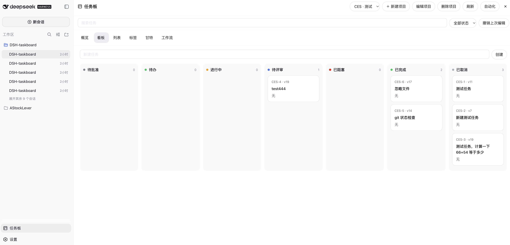

# DSH Taskboard

这是 DeepSeek Harness 的原生本地项目任务板插件。SQLite 是任务共享状态的唯一权威；Agent Session、Goal、Workspace、工具、权限和对话历史仍由 Harness 管理。

插件提供稳定任务编号、乐观版本、七种状态、依赖重检与排他认领、评论和活动、安全附件、支持重复规则的甘特图、本地存储诊断、可发现已安装 Skill/MCP 的可视化工作流、持久自动化、生成式 Typert Remote、原生 Web 页面、JSON CLI，以及 `manage-taskboard` Skill。Agent 只能把已验证工作提交到 `in_review`，只有经过认证的用户 UI/CLI 操作才能验收为 `done`。

参见[架构](docs/architecture.md)、[安全与恢复](docs/security.md)、[CLI 参考](docs/cli.md)和[逐项验收审计](docs/acceptance-audit.md)。仓库根目录的中英文提案仍是范围权威；随包发布的来源说明保存在 `THIRD_PARTY_NOTICES.md`。



## 开发与安装

要求 Node.js 22.19 以上（推荐 24）和 pnpm 11。

```sh
pnpm install
pnpm typecheck
pnpm test
pnpm build
pnpm example
pnpm pack
dsh plugin --profile web add ./shengsheng-dsh-taskboard-0.1.0.tgz
```

`cordis.patch.yml` 组合 Host 插件；Client 挂载生成的 `taskboard` Remote namespace，并通过原生侧栏与 shell overlay 注册一级页面，不使用 iframe，也不建立第二套聊天数据库。

## 关键规则

- 所有写操作必须携带精确当前版本；`TASK_STALE_VERSION` 后必须重新读取。
- 认领事务同时重检依赖、排他持有者、开发上下文、状态和版本。
- Agent 的成功终态是 `in_review`，不能直接进入 `done`。
- 用户把阻塞任务恢复到 `todo` 时会释放旧认领；直接恢复或退回到 `in_progress` 时必须原子建立新的明确认领。
- 后续用户需求会作为新的持久 Taskboard 来源消息追加到原 Session。
- 附件文件名不参与存储路径，字节先落盘，数据库行后发布；失败清理由持久队列重试。
- 大附件走一次性短期 Host capability URL，不进入 Typert JSON。
- Dashboard 与 `storage status` 使用同一组有界 SQLite 完整性、revision、记录数量、附件清理队列和孤儿认领诊断。
- Client 在每次直接写入与连接代际变化后立即刷新。页面打开期间，插件通过现有 Typert 连接执行有界 revision 长轮询：事务提交后立即唤醒并刷新 snapshot，超时轮询与周期 snapshot 作为恢复路径。该机制完全位于插件内，不要求修改 Harness 的 Host 事件白名单。

完整配置、CLI 与恢复策略见 [架构](docs/architecture.md)、[安全与恢复](docs/security.md) 和 [CLI 参考](docs/cli.md)。
